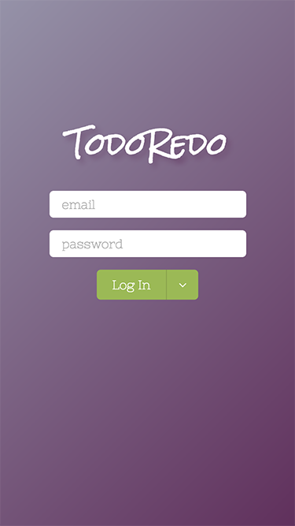
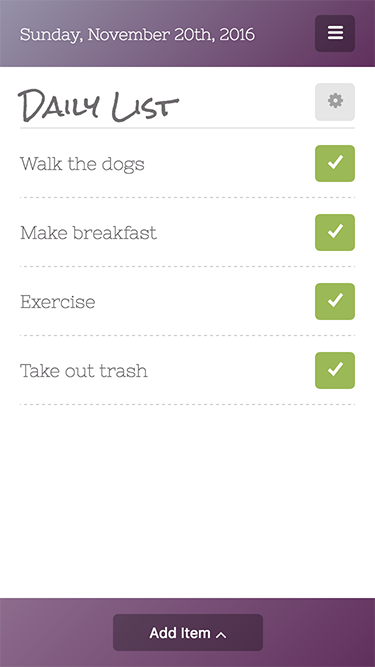
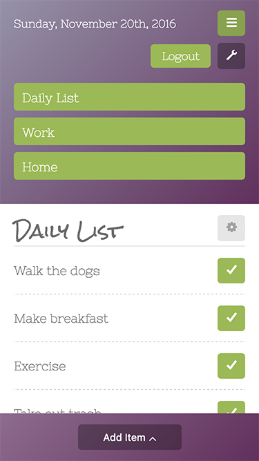
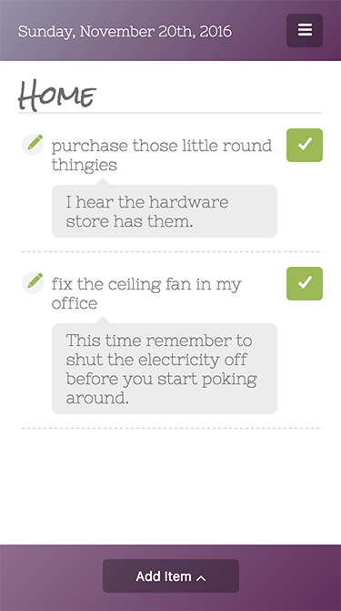

# TodoRedo

A basic todo list that resets itself each day. Every account has a Daily List that resets, and a list of regular todos that behave normally. Design and development by me.

This project uses:
* [react](https://facebook.github.io/react/)
* [webpack](https://webpack.github.io/)
* [firebase](https://firebase.google.com/)

Login with your email, or try it out using the guest account. The guest account database resets itself periodically, so don't be surprised if data resets.

The Daily List is where you can create recurring todo items for yourself.  At midnight all the completed tasks reset.

You can manage lists and add as many simple todo lists as you want.

Todo lists do not reset each day, and have the option to add a note to yourself if you need to.

